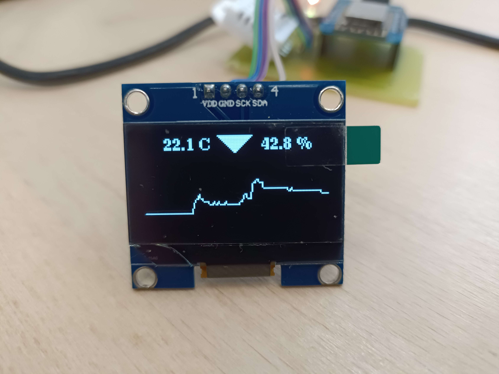

# ESP Weatherstation Firmware


<div style="width: 100%; display: flex; justify-content: center;">
    
</div>

## What's this?
This software enables an **ESP8266** driven weather station to display it's sensor data on an OLED in form of a neat graph. It also allows the weather Station to send it's weather data to [HomeDBApi](https://github.com/Nilusink/HomeDBApi), where it can be stored and requests, as well as be seen on [AndroidWeatherApp](https://github.com/Nilusink/WeatherApp).


<br><br>

# Build it yourself
## Requirements
**Minimum**
* WiFi enabled µ-controller
* **WiFi Network** with internet connection
* **DHT11/22/23** temperature and humidity sensor

**Recommended**
* I²c OLED Display
* RGB Led

<br>

## Software Build
In case you want to build your own weather station, you need to add an extra file to the code:

**_src/wserver/secrets.h_**
```cpp
#define STATION_ID <station id>
#define STATION_SECRET "\"<homedb api token>\""

#define SSID "<WiFi SSID>"
#define PWD "<WiFi Password>"
```
Everything in `<>` brackets needs to be replaced with your own data.

<br>

In case a **ESP32** is used, the headers 
```cpp
#include <ESP8266WiFi.h>
#include <ESP8266HTTPClient.h>
```

must be replaced with
```cpp
#include <ESPWiFi.h>
#include <ESPHTTPClient.h>
```

<br>

With everything configured, you are ready to go and compile!
